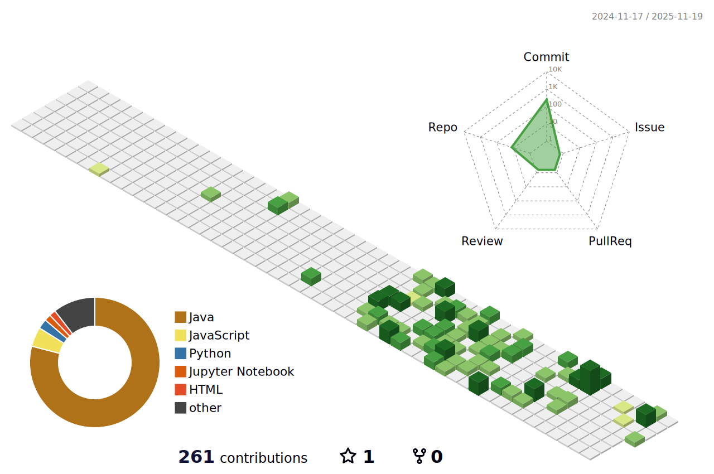

<h1 align="center">Hi 👋, I'm Janhvi Singh</h1>
<h3 align="center">💡Aspiring Data Analyst | BI Engineer | AI/ML Developer</h3>

 
  I turn <b>data</b> into <b>insights</b> and <b>AI-powered solutions</b>. Skilled in 
  <b>Tableau, Power BI, SQL, Python, AI/ML, and Advanced Excel</b>, I build 
  dashboards, analytics pipelines, and intelligent apps that help organizations 
  make <b>data-driven decisions</b>.

<!-- Profile Views -->

 
   

<!-- GitHub Trophy -->

 
   

<!-- 3D Contribution Graph -->

  

<h3 align="center">Connect with me:</h3>

  
  

<h3 align="center">Languages and Tools:</h3>

 
  <!-- Paste all your icons here from before -->

<!-- GitHub Stats -->

  

  

  

